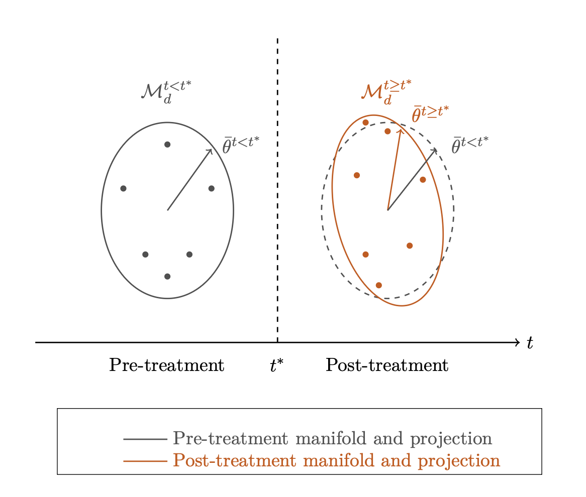
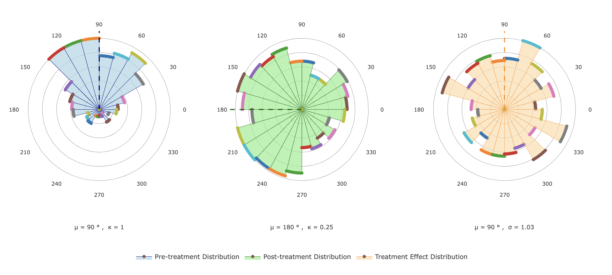

# Directional Priors in Manifold Learning: A Causal Perspective

## Abstract

This paper introduces a novel approach to incorporating prior distributional information into manifold learning through directional statistics. We propose a Bayesian framework that leverages the topological structure of data to inform directional priors, with a specific application to causal inference. Our method encodes local curvature information into the variance parameter of von Mises distributions, allowing for geometry-aware Bayesian updates of directional information on manifolds. We demonstrate the approach on a spherical manifold and extend it to develop a Manifold Regression Discontinuity (RD) estimator for causal inference.

## Key Results

### 1. Directional Priors Framework

We reparameterize manifold-projected data into polar coordinates, allowing the use of directional statistics (specifically von Mises distributions) to model angular components. This enables principled Bayesian updates of directional information while preserving the topological structure captured by manifold learning.

The posterior distribution for directional parameters takes the form:

$$
f(\mu_i, \mu^* | \{\theta_i\}_{i=1}^n) \propto \exp(\kappa \cdot \sum_{i=1}^n \cos(\theta_i - \mu_i) +\kappa^* \cdot \sum_{i=1}^n \cos(\mu_i - \mu^*))
$$

This reveals a natural shrinkage structure where the posterior mean balances prior information and observed data, weighted by their respective precision parameters.

### 2. Curvature-Informed Variance

We encode local topological information through the concentration parameter (κ) of the von Mises distribution, setting it inversely proportional to the Gaussian curvature at each manifold point. This approach ensures that:

- Regions with high curvature (significant bending) receive less weight in updates
- Flatter regions with low curvature contribute more to posterior updates

### 3. Manifold RD Estimator

We extend the framework to causal inference by developing a Manifold Regression Discontinuity estimator:

\[
f_{\tau | \theta} = 
\mathcal{VM}
\left(
  \bar{\theta}^{t \geq t^*} - \bar{\theta}^{t < t^*}, \sigma^2 
\right)
\]

Where the treatment effect is estimated as the difference between post-treatment and pre-treatment mean projection angles, with variance informed by the manifold geometry:

Simulations demonstrate the estimator's ability to recover treatment effects while accounting for topological changes:

## Implementation

All code and documentation are available at: [https://github.com/posmikdc/directional-priors](https://github.com/posmikdc/directional-priors)

## Contact

Daniel C. Posmik  
Brown University  
daniel_posmik@brown.edu

*This work is part of the PHP2530 course*
